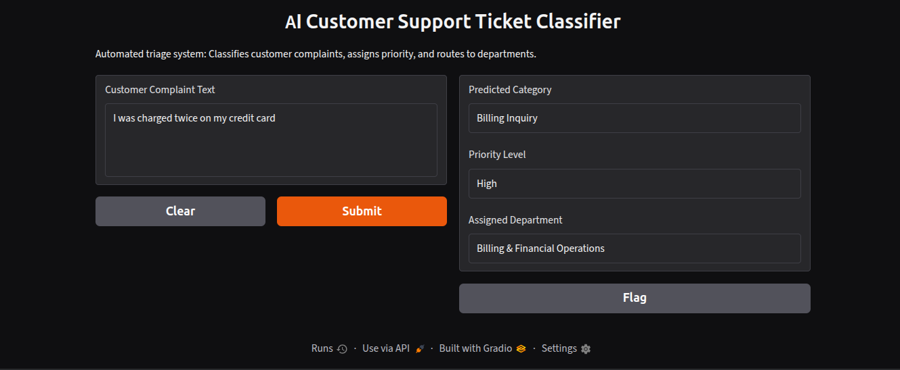

# AI Customer Support Ticket Classifier & Auto-Routing System

An end-to-end NLP and Machine Learning triage system designed to automate customer support workflows. The application analyzes incoming complaints, predicts the issue category, assigns a real-time urgency priority level, and routes tickets to the appropriate support department.

---

## 🖥 Live Interface Demo



---

## 🚀 Key Features

* **NLP Preprocessing:** Lowercasing, regex cleaning, NLTK stopword filtering, and WordNet lemmatization.
* **Feature Extraction:** TF-IDF Vectorization with unigram and bigram ranges.
* **Multi-Model Benchmarking:** Evaluated Logistic Regression, Naive Bayes, Linear Support Vector Machine (LinearSVC), and Random Forest.
* **Deterministic Logic Layer:** Transparent, rule-based urgency priority assignment (High/Medium/Low) and department mapping.
* **Live Interactive Deployment:** Web UI built and served using Gradio.

---

## 🛠 Tech Stack

* **Language:** Python
* **Machine Learning & NLP:** Scikit-Learn, NLTK, NumPy, Pandas
* **Visualization:** Matplotlib, Seaborn
* **Interface & Deployment:** Gradio, Google Colab

---

## 📊 System Architecture Pipeline

```text
Customer Complaint Text
        │
        ▼
Text Preprocessing (Cleaning, Lemmatization, Stopword Removal)
        │
        ▼
TF-IDF Vectorization (Feature Extraction)
        │
        ▼
Linear SVM Classifier (Category Prediction)
        │
        ▼
Deterministic Business Rules ──► Priority Assignment (High / Med / Low)
                             ──► Department Routing (e.g., Billing Operations)
        │
        ▼
Gradio Web Interface
 ```

 ---
 
 ## 👥 Authors
   * **Soham Pandey** — Machine Learning Models, Evaluation & Gradio UI Integration
   * * **Aman Tripathi** — Data Pipeline, Text Preprocessing & NLP Feature Extraction
